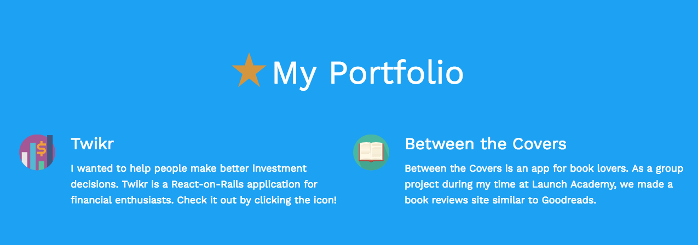

# [Portfolio](https://seanwbrooks.github.io/portfolio/)

Portfolio is a great place to start to get to know me. It contains a my beginnings section that explains how I got into web development, portfolio section with links to projects, and bios section where you can get to know me.

# Technology

**Node.js**
* Node.js is an open source server framework. It is lightweight and efficient.

**NPM**
* NPM is a package manager for Javascript. I used many packages to improve website responsiveness and help automate tasks and builds for deployment.

**Gulp**
* Gulp is a toolkit for automating painful or time-consuming tasks in your web development process. Gulp was the butter to my popcorn.

**jQuery**
* jQuery is a very popular JS library that helped me create some of the behavior for the site.

**Babel**
* Babel helps you compile next-generation Javascript.

# Getting Started

Clone repo: `git clone https://github.com/seanwbrooks/portfolio.git`

Install packages: `npm install`

Run: `gulp watch`

# Contributors
**Sean Brooks**

# Acknowledgments

* Brad Schiff - creator of Git a Web Developer Job: Mastering the Modern Workflow
